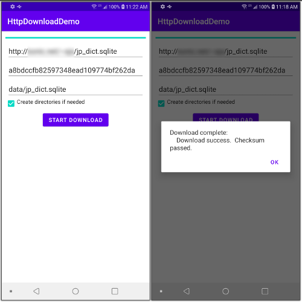

# HttpDownloadDemo

Android/Kotlin copy file using http/https from internet to local
directory and check MD5 checksum.

I developed this as a testbed for another app I'm working on.
I needed to copy an SQL file across the internet to a
local directory using https and I wanted to check it's MD5
sum to make sure it was valid.  This app does that.  What 
the script does:
* Check that you have an active internet connection.
* Make sure the url you supplied for the copy is valid.
* copy the file to a local file.
* provide a progress bar so you can see what's going on.
* Check the MD5 sum (if supplied to validate the file.

